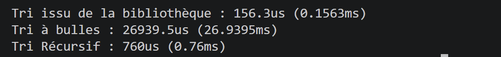
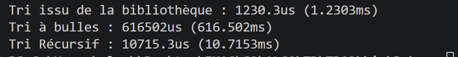

## S2 | Prog&Algo: TD03 Algorithmes de tri

# TD03 Algorithmes de tri

CHABAUD Chloé

## Exercice 3 (Comparaison des algorithmes)

## Que constatez-vous ? Que pouvez-vous en dire ?

Avec le fichier `ScopedTimer.hpp`, on a pu initialiser trois timers différents pour les fonctions de tri : tri à bulles, tri rapide et `std::sort` de la bibliothèque standard.

On obtient alors, pour un tableau de **200 éléments**, ces résultats en termes de temps d'exécution :  

Tableau de **10000 éléments**  

On remarque donc :

- le **tri rapide** (par récursivité, ex 2) est rapide, surtout pour de grands tableaux.

- le **tri à bulles** (ex1) est plus lent : il doit parcourir tout le tableau à chaque itération. Il n'est donc pas très optimal (**complexité en O(n²)**).

- le **tri `std::sort`** de la bibliothèque standard est le plus efficace, quelle que soit la taille du tableau (**complexité en O(n log n)**).

## Conclusion

L'utilisation du **tri à bulles** pour de grands tableaux n'est pas pertinente. En revanche, le **tri rapide** et le **tri `std::sort`** sont tous les deux efficaces, avec un léger avantage pour `std::sort`, qui est mieux optimisé.
